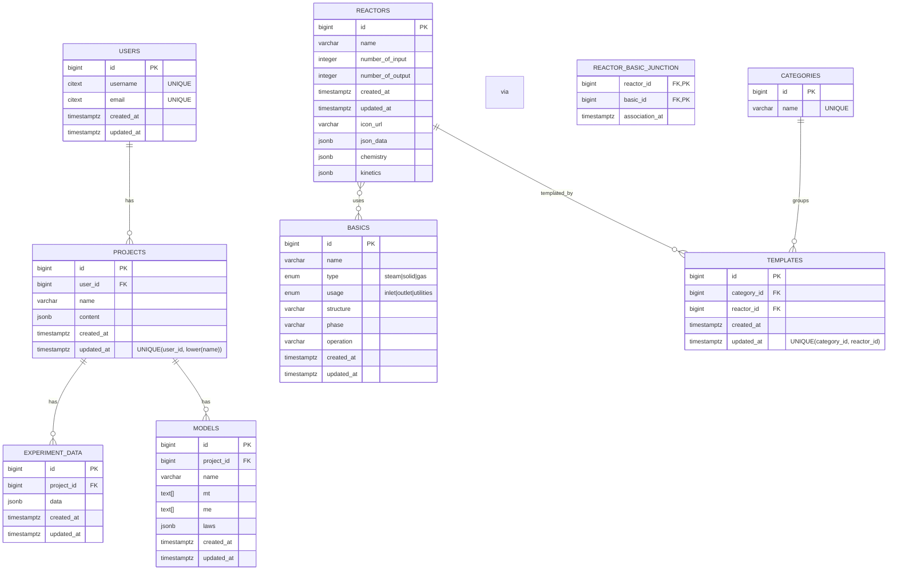

### ERD — v2 relational schema (PostgreSQL)

This ERD reflects the finalized design, including `reactors.chemistry` and `reactors.kinetics` JSONB columns and the many‑to‑many `reactor_basic_junction`.

How to render: any Markdown viewer with Mermaid support (e.g., VS Code with Markdown Preview Mermaid Support) or paste the diagram block at https://mermaid.live
