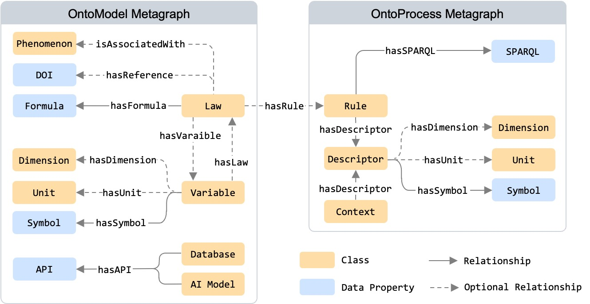
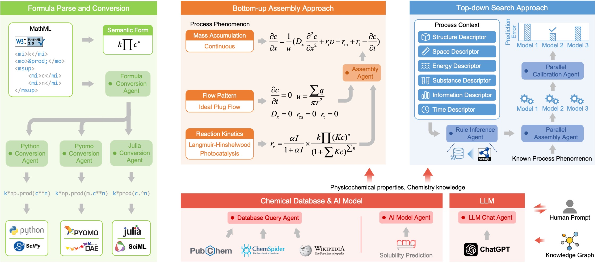

# KG4DT
<p align="center">
<a href="https://en.wikipedia.org/wiki/Knowledge_graph">
        </a>
<a href="https://en.wikipedia.org/wiki/Digital_twin">
        </a>
<a href="https://en.wikipedia.org/wiki/Model#Physical_model">
        </a>
</p>

## Local Deployment
### GraphDB
[Download GraphDB Free Version](https://email.ontotext.com/e3t/Ctc/GD+113/cGJhF04/MW_yJT37MwtW6Y7wmj6bTsFDW3wqskQ5fYyv9N1HNy_43qgyTW95jsWP6lZ3q0VD3K397YPl19N3s8WmnlnGXWW7kVjn83DrmjDN3bMZmnmyTDDN84-mP-XghhSW8QRJK_3lnKqnW1kv7by4Zl7ZHW4BtV7k13XjDGMBmf6rd_KjVW44j5Rh8QcBKDW55dJ855hD0QjW8zGhHN98nlbjW5RVt872HmMX4W2z-z3w2kQgDSW8z7MhS4g5VFWW6c6Jdt7XN7HbW5dKdpK7sFScXW5rmxtb2cWHQXVqYYX21qkg7VW1RSGKz5v5CSvW5SgDKd7CjMStW3tyfCz1hslHLW5ck34P14gF61W5qYMT1162KtNW7GChRF17hyxSVYJDkh2zwfT-W22_RVn2jhWDbW8mdT878lMQR2W5KZmGK5nvCrYW8B1zp01GF7BgdHGSfK04)  
Put the downloaded zip file under the `graphdb/dist` folder.

### Docker
```
git clone https://github.com/sustainable-processes/KG4DT.git
cd KG4DT
docker-compose up
```
Find deployed KG4DT and example cases at http://127.0.0.1:5000/index

### Local setup with Python virtual environment (.venv)
If you prefer to run without Docker:

1. Clone the repository
   - `git clone https://github.com/sustainable-processes/KG4DT.git`
   - `cd KG4DT`
2. Create and activate a virtual environment
   - macOS/Linux: `python3 -m venv .venv && source .venv/bin/activate`
   - Windows (Powershell): `py -m venv .venv; .venv\Scripts\Activate.ps1`
3. Install dependencies
   - `pip install -r requirements.txt`
4. (Optional) Configure environment variables by creating a `.env` file in the project root. Defaults are shown in parentheses:
   - `FLASK_DEBUG=True` (False)
   - `GRAPHDB_HOST=127.0.0.1`
   - `GRAPHDB_PORT=7200`
   - `GRAPHDB_USER=admin`
   - `GRAPHDB_PASSWORD=root`
   - `GRAPHDB_DB=ontomo`
   - `APP_PREFIX=` (leave empty for default)
5. Run the application
   - `python run.py`
   - The app starts at http://127.0.0.1:5000/

Note: The backend expects a running GraphDB instance with the specified credentials. See GraphDB section above.

## API Reference
Base URL: `http://127.0.0.1:5000`

Notes:
- JSON request bodies should be sent with `Content-Type: application/json`.
- Some routes are marked as deprecated in code comments but are currently available; treat them as subject to change.

### Model
- GET `/api/model` (deprecated)
  - Returns entity data for sidebar.
  - Example: `curl http://127.0.0.1:5000/api/model`

- GET/POST `/api/model/context`
  - Body (JSON): `{ "case": "dushman" | "esterification", "postfix": "model_context.json" | "<suffix>" }`
  - If `postfix` lacks `.json`, file name becomes `model_context_<postfix>.json`.
  - Loads file from `backend/cases/<case>/<postfix>`.
  - 404 if case or file missing.
  - Example: `curl -X POST http://127.0.0.1:5000/api/model/context -H 'Content-Type: application/json' -d '{"case":"dushman","postfix":"model_context.json"}'`

- GET/POST `/api/model/var`
  - Returns model variables from GraphDB.
  - Example: `curl http://127.0.0.1:5000/api/model/var`

- GET/POST `/api/model/unit`
  - Returns units from GraphDB.
  - Example: `curl http://127.0.0.1:5000/api/model/unit`

- POST `/api/model/save`
  - Saves the provided payload as JSON under `backend/save/` with a timestamped filename.
  - Body (JSON): must be an object. `users` must be an object; optional list fields `s`, `v`, `p` must be lists.
  - Response: `{ "success": true, "file": "<name>.json", "path": "save/<name>.json" }`
  - Example:
    ```
    curl -X POST http://127.0.0.1:5000/api/model/save \
      -H 'Content-Type: application/json' \
      -d '{
            "users": {"id": "u1", "project_name": "proj", "model": "m"},
            "s": [], "v": [], "p": []
          }'
    ```

- GET `/api/model/load?project_name=<name>`
  - Loads the most recent saved file for the given project_name.
  - Query param: `project_name` (required).
  - Response: `{ "success": true, "file": "...", "data": { ... } }`
  - Example: `curl 'http://127.0.0.1:5000/api/model/load?project_name=proj'`

### Structure
- GET `/api/structure`
  - Returns entity data for sidebar.
  - Example: `curl http://127.0.0.1:5000/api/structure`

- GET/POST `/api/structure/context`
  - Body (JSON): `{ "case": "dushman", "postfix": "model_context.json" }`
  - If `postfix` lacks `.json`, file name becomes `model_context_<postfix>.json`.
  - Example: `curl -X POST http://127.0.0.1:5000/api/structure/context -H 'Content-Type: application/json' -d '{"case":"dushman"}'`

### Application (deprecated)
- GET `/api/application`
  - Returns entity data for sidebar.
- GET/POST `/api/application/context`
  - Same contract as `/api/structure/context`.

### Knowledge Graph
- GET `/api/knowledge_graph/mainpage`
  - Returns entity data for knowledge graph main page.
  - Example: `curl http://127.0.0.1:5000/api/knowledge_graph/mainpage`

- GET `/api/knowledge_graph/sidebar` (deprecated)
  - Computes knowledge graph data from sidebar entity.

- GET `/api/knowledge_graph/context/<case>`
  - Loads `top_down_rule_model_context.json` for the given case directory.
  - 404 if missing.
  - Example: `curl http://127.0.0.1:5000/api/knowledge_graph/context/esterification`

- POST `/api/knowledge_graph/context`
  - Body (JSON): `{ "case": "esterification", "postfix": "top_down_rule_model_context.json" | "<suffix>" }`
  - If `postfix` lacks `.json`, file becomes `top_down_<postfix>_model_context.json`.

### Solvent Properties and Miscibility
- POST `/api/solvent`
  - Body (JSON):
    - `solvents` (list, required): e.g., `["water", "ethanol", "acetone"]`
    - `properties` (list, optional): defaults `["Density", "Viscosity"]`
    - `property_sources` (list, optional): any of `["pubchem", "wikipedia", "chemspider"]`; defaults to all
    - `include_miscibility` (bool, optional): default `true`
  - Response (JSON):
    - `properties`: per-source values and a `merged` view (first non-null by source priority)
    - `miscibility`: Sigma-Aldrich-based miscibility matrix if requested
  - Example:
    ```
    curl -X POST http://127.0.0.1:5000/api/solvent \
      -H 'Content-Type: application/json' \
      -d '{
            "solvents": ["water", "ethanol"],
            "properties": ["Density", "Viscosity"],
            "property_sources": ["pubchem", "wikipedia"],
            "include_miscibility": true
          }'
    ```

## Features
### Metagraph

Inspired by the pioneering schema [OntoCAPE](https://www.avt.rwth-aachen.de/cms/avt/forschung/sonstiges/software/~ipts/ontocape/?lidx=1), OntoModel and OntoProcess as ontologies are designed to bridge the gap between model and process knowledge for developing physical model-based chemical process digital twins.

### Agents

Multiple functional agents are developed to harness the knowledge graph for model assembly, model calibration, rule inference, database access, AI model invocation, and LLM utilisation.
- Available databases: [PubChem](https://pubchem.ncbi.nlm.nih.gov), [ChemSpider](https://www.chemspider.com), and [Wikipedia](https://www.wikipedia.org)
- Example solubility prediction model from the [RMG Group](https://rmg.mit.edu/database/solvation/searchSolubility/)
- [ChatGPT](https://platform.openai.com/settings/organization/api-keys) integrated

## Cases
Prerequisite: KG4DT is locally deployed successfully.
- Bottom-up case: annular microreactor
    - http://127.0.0.1:5000/model/dushman
    - http://127.0.0.1:5000/structure/dushman
    - http://127.0.0.1:5000/application/dushman
        - select <b>dushman</b>, click <b>Import</b>
        - select <b>simulation</b>, click <b>Run</b> to simulate the pristine model
        - select <b>calibration</b> and <math><msub><mi>k</mi><msub><mi>t</mi><mtext>m</mtext></msub></msub></math>, set <b>min</b> to 0.001 and <b>max</b> to 0.01, click <b>Run</b> to calibrate the model
        - select <math><msup><msub><mi>I</mi><mn>3</mn></msub><mo>−</mo></msup></math> to check the result
- Top-down case: Taylor-Couette reactor
    - http://127.0.0.1:5000/knowledge_graph/esterification
        - select <b>top-down</b> mode
        - select <b>esterification</b>, click <b>Import</b>
        - click <b>Infer</b> to proceed rule inference
        - click <b>SPARQL</b> of the <b>Rule</b> card to check SPARQL codes
    - http://127.0.0.1:5000/exploration/esterification
        - select <b>esterification base case</b>, click <b>Import</b>
        - click <b>Run Model Exploration</b> to proceed parallel model calibration
- Amidation reaction optimisation
    - http://127.0.0.1:5000/chatgpt
        - input your own <b>OpenAI API Key</b>. Find information <a href="https://platform.openai.com/settings/organization/api-keys">here</a>
        - click <b>Go</b> to get the answer